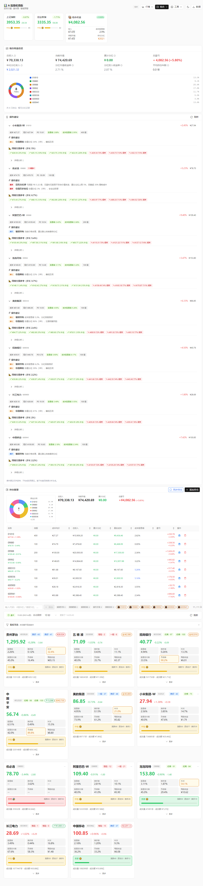

# 📊 ts-stock-monitor

> A 股 / 港股全栈量化看板 —— Next.js 16 + TypeScript + Tailwind CSS + Python 数据管道
>
> **本项目全程 AI 辅助开发（Claude Code）**，是一次「需求 → 实现 → 验证 → 迭代」由 AI 驱动的完整全栈交付实践。

面向个人投资者的量化看板：实时行情、基本面财务、三模型估值评分、恐慌指数、智能预警微信推送、持仓管理。前端 Next.js App Router，后端 Python 定时数据管道 + 文件缓存，A股与港股双市场支持。

## 🖼 界面预览

看板总览（指数 · 组合收益 · 操作建议 · 持仓管理 · 智能评分表格）——截图为演示持仓数据：




## ✨ 功能总览

| 模块 | 说明 |
|------|------|
| 📈 实时行情 | A 股（新浪财经）+ 港股（东方财富）实时价格、涨跌幅、成交量、换手率、EPS、大盘指数 |
| 💰 基本面与财务 | PE / PB / 股息率 / 总市值；财务指标覆盖负债率、毛利率、ROE / ROIC、经营现金流净利比（A 股 F10 + 港股 HKF10 年报） |
| 🎯 安全边际评分 | 格雷厄姆 + 成长 + DDM **三模型加权融合**（30% / 40% / 30%），0-100 分评估价格安全边际 |
| 😱 恐慌指数 | **5 分量合成**：RSI(14)、MA20 偏离度、量比、5 日累计涨跌幅、20 日均振幅（akshare K 线缓存） |
| ⚠️ 智能预警 | 自定义规则（股息率 / 换手率 / 恐慌指数 / 成交量异常等），盘中实时检查并**推送微信** |
| 💼 持仓管理 | 支持券商持仓表格直接粘贴同步；持仓自动并入自选清单；港股自动汇率换算 |
| 🗂️ 多视图 | 表格 / 卡片双视图，可排序筛选，数值异常自动着色（涨停 / 跌停 / 高换手 / 高股息） |
| 🔄 定时任务 | Python 脚本定时抓取 + JSON 文件缓存；前端 5/10/30/60 秒自动刷新 |

## 🏗 架构

```
数据源（新浪财经 / 东方财富 / akshare）
        │  Python 定时抓取（scripts/*.py，含代理自动回退）
        ▼
JSON 文件缓存（data/*.json：行情 / 财务 / 估值 / K 线技术指标）
        │                       │
        ▼                       ▼
Next.js API 路由（服务端代理）   预警引擎（Python，systemd timer 驱动）
        │                       │
        ▼                       ▼
React 前端（表格 / 卡片视图）    微信推送（交易时段守卫 + 去重 + 失败落盘防丢）
```

- **展示层**不直接调用外部接口，全部经服务端 API 路由代理
- **数据层**直连优先、失败自动回退代理，中文域名 getent 解析兜底，重试 + 退避
- **缓存**支持过期自愈，评分维度设最低覆盖防线（数据不全时降权而非失真）

## 🚀 快速开始

```bash
git clone https://github.com/LeifJG/ts-stock-monitor.git
cd ts-stock-monitor

# 前端（Node 18+，pnpm）
pnpm install
pnpm run dev        # http://localhost:3000

# 后端数据管道（Python 3.10+）
python3 -m venv .venv
.venv/bin/pip install -r requirements.txt   # akshare / requests 等
.venv/bin/python scripts/financials_data.py # 手动触发一次财务抓取
```

## 📖 核心设计

### 安全边际评分：三模型加权融合

| 模型 | 权重 | 思路 |
|------|------|------|
| 格雷厄姆 | 30% | `√(22.5 × EPS × BVPS)` 经典安全边际 |
| 成长模型 | 40% | 可持续增长率 `g = ROE × (1 − 分红率)`，缺乏真实分红率时按 ROE 分档估计 |
| DDM | 30% | 股利贴现模型，适用于稳定分红标的 |

单一模型各有盲区，加权融合后评分更稳健；估值维度采用历史分位优先、PE 兜底的计入策略，避免静态阈值失真。

| 等级 | 评分 | 含义 |
|------|------|------|
| 🟢 优秀 | ≥ 70 | 安全边际充足，显著低于估值 |
| 🔵 良好 | 40-70 | 合理偏低 |
| 🟡 一般 | 10-40 | 接近估值 |
| 🔴 危险 | < 10 | 高于估值，偏贵 |

### 恐慌指数：5 分量情绪合成

| 分量 | 含义 |
|------|------|
| RSI(14) | 超买超卖强度 |
| 价格 vs MA20 偏离度 | 短期趋势偏离 |
| 量比（当日量 / 20 日均量） | 情绪放大信号 |
| 5 日累计涨跌幅 | 短期动量 |
| 20 日平均振幅 | 波动率水平 |

### 智能预警 → 微信推送

预警引擎由 systemd timer 驱动，包含一套生产级可靠性设计：

- **交易时段守卫**：仅 A 股（9:30-15:00）与港股（9:30-16:00）时段运行，非交易时间静默
- **去重窗口**：同一规则触发后冷却，避免重复轰炸
- **失败兜底**：推送重试 3 次，全部失败则内容落盘防丢，恢复后补推

### 表格颜色语义

| 颜色 | 含义 |
|------|------|
| 🔴 红色加粗 | 涨跌幅 > +9.5%（涨停） |
| 🟢 绿色加粗 | 涨跌幅 < -9.5%（跌停） |
| 🟠 橙色 | 换手率 > 5% / > 10%（活跃 / 异常活跃） |
| 🟢 绿色 | 股息率 > 5%（高股息） |
| ⚪ 灰色 | 市盈率为负（亏损） |

## 🛠 技术栈

| 层 | 技术 |
|----|------|
| 前端 | Next.js 16 (App Router)、React、TypeScript、Tailwind CSS、Ant Design、tiptap |
| 后端 | Python 3（akshare、并发抓取）、Bash（systemd timer 脚本） |
| 数据源 | 新浪财经（行情）、东方财富（基本面 / F10 / 港股 HKF10）、akshare（历史 K 线） |
| 存储 | JSON 文件缓存（无外部数据库依赖，单机即跑） |
| 推送 | 微信（盘中预警 + 日报） |

## 📁 项目结构

```
src/                          # Next.js 前端 + API 路由
├── app/api/stocks/           #   服务端数据代理（个股 + 指数）
├── components/               #   表格 / 卡片 / 预警表单 / 指数卡片
├── hooks/                    #   useStockData / useAlerts / useLocalStorage
└── lib/
    ├── indicators.ts         #   三模型评分 + 恐慌指数计算
    ├── stock-api.ts          #   多数据源适配（含代理回退）
    └── alert-engine.ts       #   预警规则引擎

scripts/                      # Python 数据管道
├── financials_data.py        #   财务指标抓取（A 股 F10 + 港股 HKF10）
├── fear_tech_data.py         #   K 线技术指标（RSI / MA20 / 量比…）
├── valuation_data.py         #   估值与历史分位
├── dividend_data.py          #   分红 / 股息率
├── fetch_fx_rate.py          #   港元汇率
├── alert_checker.py          #   预警检查引擎
└── alert_push.sh             #   微信推送（systemd timer 调用）

data/                         # JSON 文件缓存（financials / fear_tech / valuation …）
```

## 🤖 关于 AI 辅助开发

本仓库同时是一个 **AI 驱动全栈交付的工作流样本**：

- **开发方式**：需求以自然语言描述 → Claude Code 实现 → 真实行情数据回归验证 → git 提交，全程无手工编码
- **真实实战案例**：React hydration mismatch 导致数据流静默失效的排查与修复、多数据源代理回退策略、评分体系多轮迭代（维度去重 / 分位优先 / 最低覆盖防线）
- **验证原则**：每个功能必须通过真实数据测试才合并——AI 生成的代码同样要为正确性负责

## ⚠️ 免责声明

本项目数据来自公开网络接口，仅供个人研究学习使用，不构成任何投资建议。
